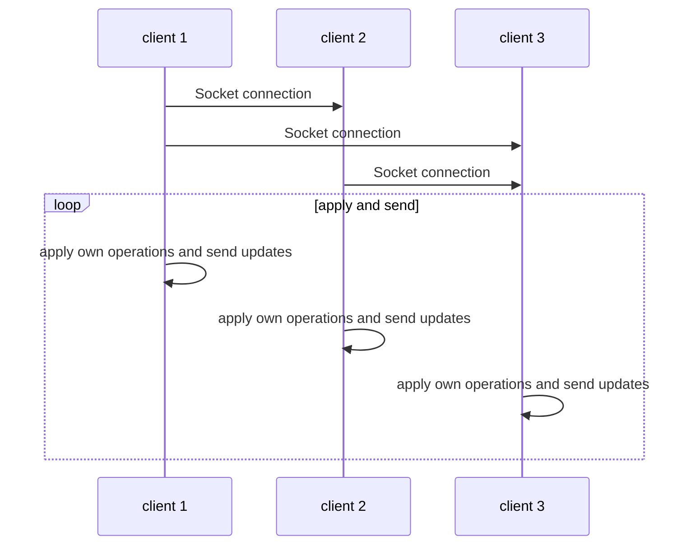

# Conflict-Free-Doc-Editing
This project is "docs-like" string editor, to asynchronously avoid conflicts.
This project was made by [**Yakir**](https://github.com/yakirbit) and [**Tom**](https://github.com/ToMax446) as a class assignment.
This project was written in JavaScript with Node.js

## Requirements
 - Node.js
 - Your favourite text editor

## Notes on the project

### Run
#### Initialization
Each client tries to connect via socket to clients with greater id, and then raises an http server to allow connections from clients with lower id.
#### Asynchronous
We defined a callback on each client's socket to update it's time stamp, and to apply the merge algorithm.
#### Conflict Free Replicated Data
CRDT operations need to by commutative, but text operations aren't.
Because of that problem, we needed to apply a total-ordered stamps, and we couldn't use time vectors, as adding client id to those would've harmed the transitivity. Therefore we used a regular time stamp.
After applying an update, if the client received an older operation, it reverts it's own and previous operations until the older one, and applies them again properly.

The client will clean it's older operations history when newer operations arrive from the same client.

----

## UML diagram of the project

The UML was created with  [Mermaid](https://mermaidjs.github.io/).

